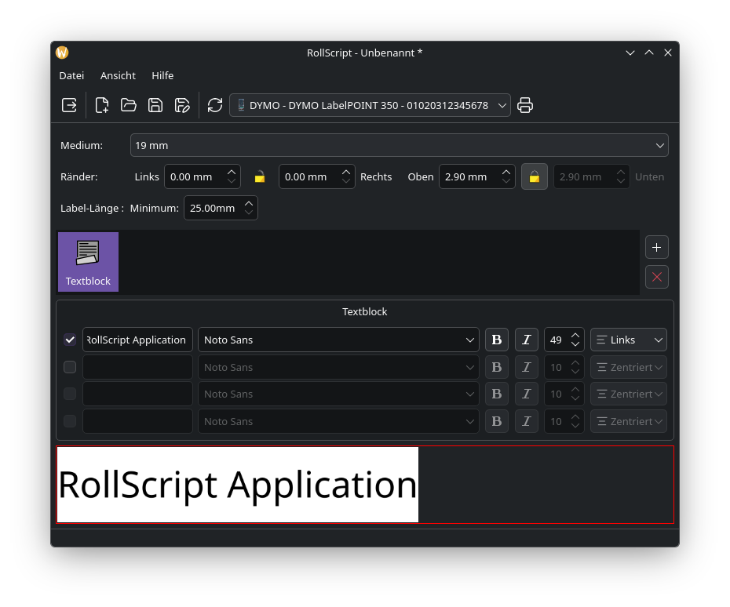

# RollScript

**Open-source software for designing and printing labels on continuous rolls.**

RollScript is a cross-platform label printing application focused on continuous label media.

It is designed from the beginning to be modular and extensible. Printer support and application features are implemented through a plugin architecture, allowing RollScript to grow without turning the core application into a monolithic codebase.

> 🚧 **RollScript is currently under active development.**



## Current Status

RollScript is currently in an early development stage.

The application already provides the basic foundation for designing labels and printing them on supported continuous-roll printers.

The project is being developed openly on GitHub, and contributions, ideas and feedback are welcome.

## Features

Current functionality includes:

* Label design using blocks
* Text blocks
* Continuous-roll label support
* Configurable label width and margins
* Minimum label length configuration
* Printer selection
* Automatic printer discovery
* Plugin-based architecture
* Qt 6 / C++
* Linux support

The feature set will continue to evolve as development progresses.

## Supported Printers

### DYMO LabelPOINT 350

The first printer supported by RollScript is the **DYMO LabelPOINT 350**.

Printer support is implemented as a separate printer plugin. This architecture allows additional printers to be added without modifying the core application.

More printers will be added over time.

The project is designed to support different printers and printing technologies through an extensible architecture.

## Plugin Architecture

RollScript uses a plugin-based architecture for extending the application.

Plugins are separated into different categories, including:

* Printer plugins
* Feature plugins

This allows functionality to be added independently from the core application.

The long-term goal is to make it possible for the community to develop and distribute additional plugins.

More information about the plugin architecture can be found in:

* [ARCHITECTURE.md](ARCHITECTURE.md)

Plugin developer documentation will be added as the plugin API becomes stable.

## Technology

RollScript is written in:

* **C++**
* **Qt 6**
* **CMake**

The project is developed with a strong focus on:

* Clean separation of responsibilities
* Modular architecture
* Low coupling between components
* Extensibility through plugins
* Cross-platform development

The project's coding conventions are documented in:

* [CODING_STYLE.md](CODING_STYLE.md)
* [CODING_STYLE_SOURCE.md](CODING_STYLE_SOURCE.md)
* [CODING_STYLE_HEADER.md](CODING_STYLE_HEADER.md)

## Building

RollScript is currently primarily developed and tested on Linux.

A local development build requires:

* C++ compiler with C++ support required by the project
* Qt 6
* CMake 3.24 or newer

Clone the repository:

```bash
git clone https://github.com/mzsoftsoftware/RollScript.git
cd RollScript
```

Create a build directory:

```bash
cmake -S . -B build
```

Build the project:

```bash
cmake --build build
```

The project is still under active development, so build and installation requirements may change.

## Contributing

Contributions are welcome!

There are many ways to contribute:

* Report bugs
* Suggest features
* Improve documentation
* Improve the user interface
* Add printer support
* Develop plugins
* Improve the code
* Test RollScript with different hardware

Before contributing code, please read [CONTRIBUTING.md](CONTRIBUTING.md) and the project's coding style documentation.

For larger changes, opening an issue first is recommended so that the proposed approach can be discussed before implementation.

## Community

Use GitHub Discussions for:

* Questions
* Ideas
* General discussions
* Sharing projects and plugins

Use GitHub Issues for:

* Bug reports
* Concrete feature requests
* Actionable development tasks

## Roadmap

See [ROADMAP.md](ROADMAP.md) for planned features and development goals.

The roadmap is intentionally flexible and will evolve together with the project.

## Security

Please do not report security vulnerabilities through public GitHub Issues or Discussions.

For security-related reports, please see [SECURITY.md](SECURITY.md).

## License

RollScript is open-source software licensed under the [Apache License 2.0](LICENSE).

## About

RollScript is developed and maintained by **MZ Software GmbH**.

For more information about MZ Software GmbH, visit [www.mzsoft.de](https://www.mzsoft.de).
